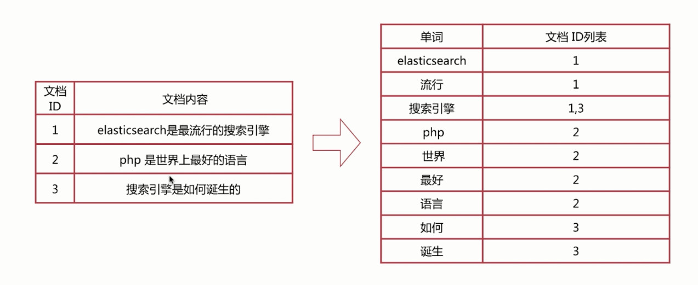
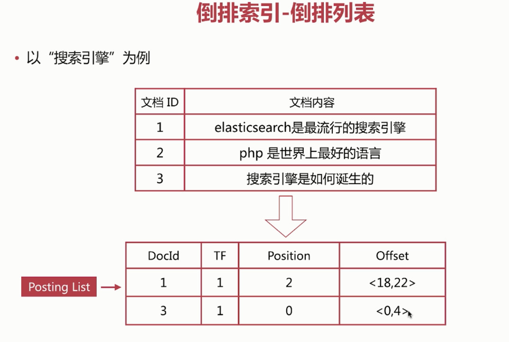
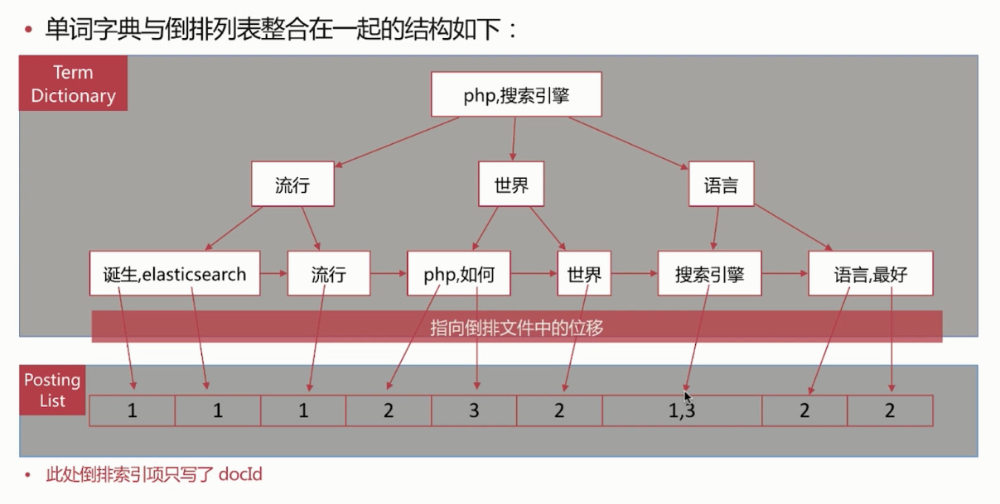

[TOC]


### 正排索引

- 文档id到文档内容、单词的关联关系

  | 文档id |            文档内容             |
  | :----: | :-----------------------------: |
  |   1    | elasticsearch是最流行的搜索引擎 |
  |   2    |      php是世界上最好的语言      |
  |   3    |      搜索引擎是如何诞生的       |


### 倒排索引

- 单词到文档id的关联关系

|     单词      | 文档id列表 |
| :-----------: | :--------: |
| elasticsearch |     1      |
|     流行      |     1      |
|   搜索引擎    |    1,3     |
|      php      |     2      |
|     世界      |     2      |
|     最好      |     2      |
|     语言      |     2      |
|     如何      |     3      |
|     诞生      |     3      |

上面的表格就是正排索引转换成倒排索引的



#### 倒排索引-查询流程

- 查询包含“搜索引擎”的文档
  - 通过倒排索引获得“搜索引擎”对应的文档有1和3
  - 通过正排索引查询1和3的完整内容
  - 返回结果

#### 倒排索引组成

倒排索引是搜索引擎的核心，主要包含两部分：

- 单词词典，一般使用B+ Tree实现

  - 记录所有文档的单词，一般比较大
  - 记录单词到倒排列表的关联信息

- 倒排列表，记录了单词对应的文档集合，由倒排索引项组成。主要包含如下信息：

  - 文档Id，用于获取原始信息

  - 单词频率(TF,Term Frequency)，记录该单词在该文档中出现次数，用于后续相关性算分

  - 位置(Position)，记录单词在文档中的分词位置(多个)，用于做词语搜索

  - 偏移(Offset)，记录单词在文档的开始和结束位置，用于高亮显示

    具体如下图：

    

- 单词字典与倒排列表整合在一起的结构：

  

- 整个搜索流程，先通过B+树找到关键字，然后再找到倒排列表然后进行相关性算分再通过正排索引获取文档

#### ES中倒排索引的存储

- es存储的是一个json格式，包含多个字段，每个字段会有自己的倒排索引，例如

  ```json
  {
      "name":"alfred",
      "job":"programmer"
  }
  ```

  这个文件，name有一个倒排索引、job有一个倒排索引